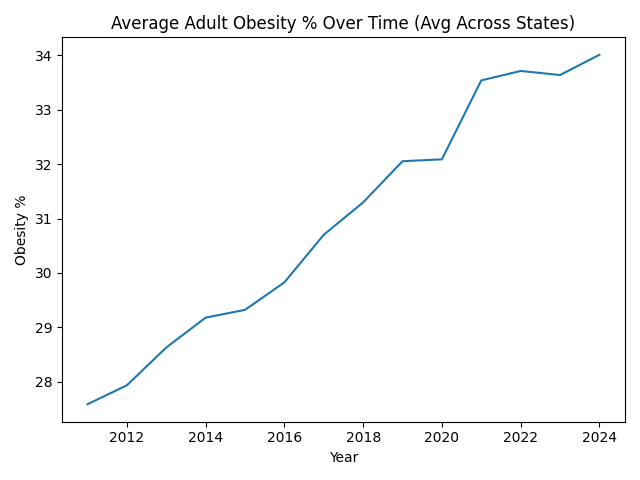
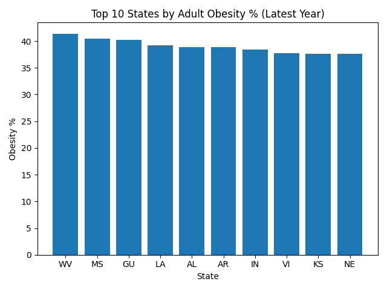
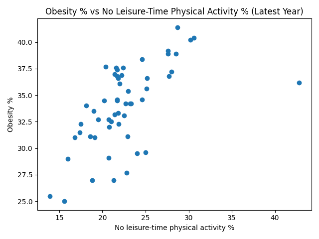
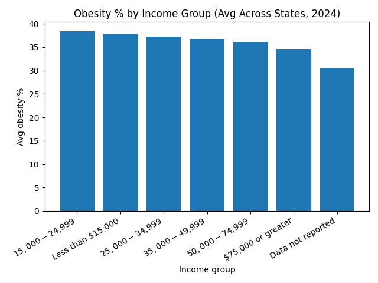
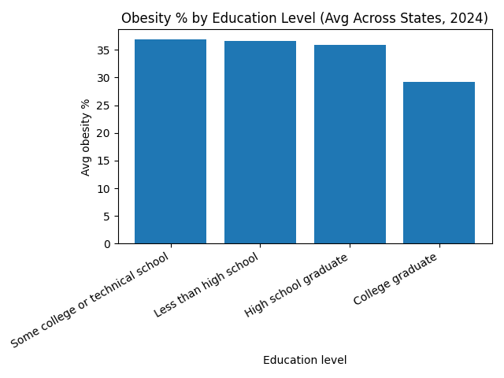

# Public Health Obesity Analytics Warehouse

## Overview
This project builds an end-to-end **public health analytics warehouse** using publicly available CDC data on nutrition, physical activity, and obesity. The pipeline ingests raw data, models analytics-ready marts using DuckDB and SQL, and produces visual insights to support population health and health equity analysis across U.S. states from **2011 to 2024**.

The focus of the project is not only trend analysis, but also identifying **socioeconomic and educational disparities** in adult obesity prevalence.

---

## Objectives
- Build a reproducible analytics pipeline using only **free, browser-based tools**
- Model clean, queryable marts for public health indicators
- Analyze long-term obesity trends and state-level rankings
- Quantify **health disparities by income and education**
- Produce stakeholder-ready visualizations and insights

---

## Dataset
- **Source:** CDC – Nutrition, Physical Activity, and Obesity (Public Dataset)
- **Time Period:** 2011–2024
- **Geography:** U.S. States and Territories
- **Population:** Adults aged 18+

---

## Tech Stack 
- **GitHub Codespaces** – cloud-based development environment
- **Python** – data ingestion, transformation, automation
- **DuckDB** – embedded analytical data warehouse
- **SQL** – analytics marts and aggregation logic
- **Matplotlib** – data visualization

---

## Repository Structure
├── scripts/
│ ├── 01_load_to_duckdb.py
│ ├── 02_inspect_data.py
│ ├── 03_create_marts_precise.py
│ ├── 04_make_charts.py
│ ├── 05_create_disparity_marts.py
│ └── 06_make_disparity_charts.py
├── dashboards/
│ ├── avg_obesity_trend.png
│ ├── top10_obesity_latest.png
│ ├── obesity_vs_no_activity_latest.png
│ ├── obesity_by_income_latest.png
│ └── obesity_by_education_latest.png
└── README.md


---

## Pipeline Architecture
1. **Raw Layer**
   - Load CDC obesity and physical activity CSV data into DuckDB

2. **Analytics Marts Layer**
   - State-level obesity trends over time
   - Latest-year obesity rankings
   - Physical inactivity indicators
   - Stratified disparity marts (income, education, sex, race/ethnicity)

3. **Visualization Layer**
   - Trend charts
   - Ranking charts
   - Disparity charts by income and education

---

## Key Findings 

### Top 10 States by Adult Obesity Prevalence
| State | Obesity % | Rank |
|------|-----------|------|
| WV | 41.4 | 1 |
| MS | 40.4 | 2 |
| GU | 40.2 | 3 |
| LA | 39.2 | 4 |
| AL | 38.9 | 5 |
| AR | 38.9 | 5 |
| IN | 38.4 | 7 |
| VI | 37.7 | 8 |
| KS | 37.6 | 9 |
| NE | 37.6 | 9 |

### Socioeconomic Insights
- Adult obesity prevalence is **higher in lower-income groups**
- Individuals earning **$75,000 or more** have notably lower obesity prevalence than those earning under $25,000
- Obesity prevalence **declines consistently with higher educational attainment**
- College graduates show substantially lower obesity rates compared to individuals with high school education or less

---

## Visual Insights

### Average Adult Obesity % Over Time (2011–2024)


### Top 10 States by Obesity % (Latest Year)


### Obesity % vs No Leisure-Time Physical Activity (Latest Year)


---

## Health Disparities Insights (Stratified Analysis)

To evaluate health equity gaps, the pipeline builds **stratified analytics marts** for adult obesity prevalence by:
- Income
- Education
- Sex
- Race/Ethnicity

These marts enable comparisons across demographic groups, geographies, and time.

### Obesity % by Income Group (Latest Year)


### Obesity % by Education Level (Latest Year)


**Disparity Marts Used**
- `marts.mart_obesity_by_income`
- `marts.mart_obesity_by_education`
- `marts.mart_obesity_by_sex`
- `marts.mart_obesity_by_race`

---

## To Run the Project
Run the following commands from the repository root in GitHub Codespaces:

```bash
python scripts/01_load_to_duckdb.py
python scripts/03_create_marts_precise.py
python scripts/04_make_charts.py
python scripts/05_create_disparity_marts.py
python scripts/06_make_disparity_charts.py
